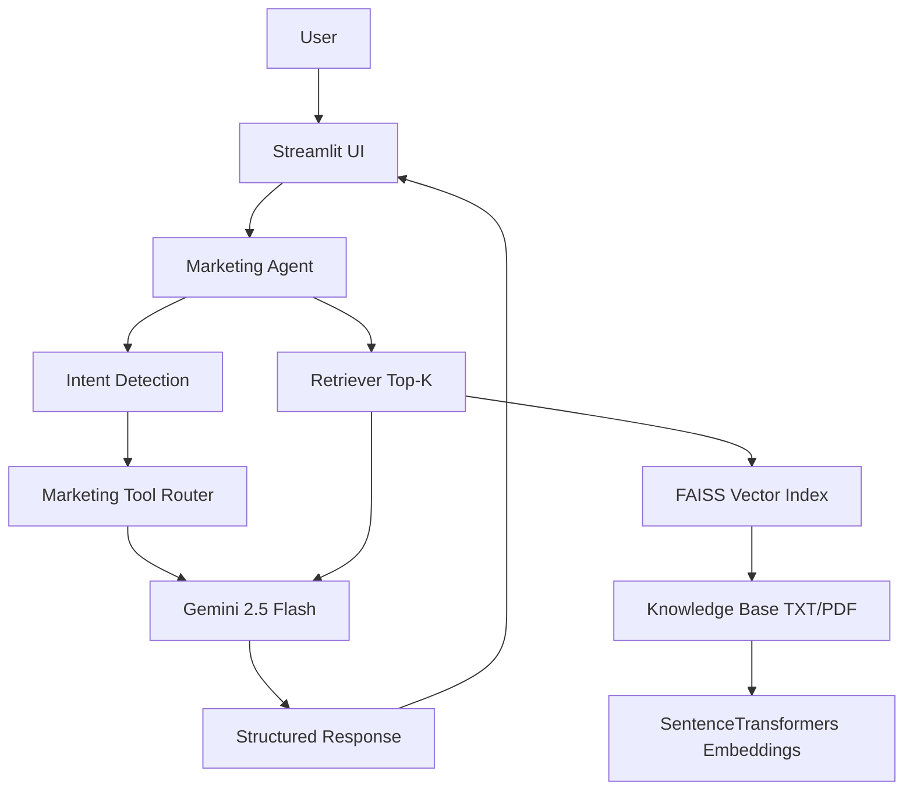

# Marketing Campaign Strategist AI Agent

A production-ready, domain-specific AI agent for marketing strategy. This project refactors the original customer-support assistant into a **Marketing Campaign Strategist AI Agent** while preserving the existing Streamlit UI pattern, RAG pipeline, FAISS vector store, SentenceTransformers embeddings, conversation memory, Gemini 2.5 Flash reasoning, and tool-calling architecture.

## Project Overview

The agent helps marketers:

- Generate campaign ideas
- Analyze customer segments and personas
- Summarize marketing reports
- Recommend marketing improvements
- Explain campaign KPIs such as CAC, CTR, ROAS, and conversion rate
- Answer questions only from retrieved knowledge-base evidence

Every response is structured with:

- Summary
- Insights
- Recommendations
- Supporting Evidence
- Confidence Score

The guardrail phrase **"This recommendation is based on the retrieved knowledge base."** is required in generated answers.

## Architecture



## Features

- **LLM reasoning:** Gemini 2.5 Flash creates final responses from retrieved context and tool output.
- **RAG:** Documents are loaded, chunked, embedded, stored in FAISS, and retrieved as top-k context.
- **Prompt engineering:** Professional marketing strategist system prompt plus five few-shot examples.
- **Guardrails:** The agent refuses unsupported exact statistics, fabricated case studies, and misleading claims.
- **Structured outputs:** Responses must include Summary, Insights, Recommendations, Supporting Evidence, and Confidence Score.
- **Tool calling:** Five marketing-specific tools replace customer-support actions.
- **Conversation memory:** Recent chat history is included in response generation.
- **Source citation support:** Retrieved chunks include `[Source: filename]` labels and are shown in the UI.
- **Inspector panel:** Shows retrieved chunks, confidence score, reasoning trace, pipeline steps, and tool output.

## Installation

```bash
python -m venv .venv
source .venv/bin/activate
pip install -r requirements.txt
```

Create a `.env` file:

```bash
GEMINI_API_KEY=your_google_gemini_api_key
```

Run the app:

```bash
streamlit run app.py
```

## Folder Structure

```text
.
├── app.py                         # Streamlit UI and agent inspector
├── agent.py                       # Marketing agent orchestration, prompt, guardrails
├── rag.py                         # FAISS + SentenceTransformers RAG pipeline
├── tools.py                       # Marketing tool registry and tool implementations
├── requirements.txt               # Python dependencies
├── knowledge_base/
│   ├── marketing_fundamentals.txt
│   ├── digital_marketing.txt
│   ├── customer_segmentation.txt
│   ├── campaign_metrics.txt
│   ├── brand_guidelines.txt
│   └── marketing_funnel.txt
└── evaluation/
    └── evaluation_examples.md
```

## RAG Pipeline

1. Load marketing `.txt` and optional `.pdf` documents from `knowledge_base/`.
2. Normalize whitespace.
3. Chunk documents into overlapping word chunks.
4. Embed chunks with `all-MiniLM-L6-v2` from SentenceTransformers.
5. Store embeddings in a FAISS `IndexFlatL2` index.
6. Retrieve the top-k most relevant chunks for each user question.
7. Send retrieved context to Gemini with guardrails and tool output.

If embeddings are unavailable, the pipeline falls back to keyword retrieval so the demo remains functional.

## Prompt Engineering

The system prompt instructs the agent to:

- Use retrieved context first
- Never fabricate information
- Clearly state when the knowledge base lacks enough evidence
- Explain visible reasoning steps concisely
- Produce structured responses
- Include confidence level
- Include the required guardrail phrase

Five few-shot examples demonstrate campaign generation, segment analysis, KPI explanation, report summarization, and SEO recommendations.

## Knowledge Base

The included sample marketing knowledge covers:

- Marketing strategies
- Customer personas
- KPIs
- CAC
- CTR
- ROAS
- Conversion rate
- Email marketing
- SEO
- Social media
- Branding
- Funnel strategy

## Marketing Tools

The project preserves the original tool-registry architecture while replacing support tools with:

- `CampaignIdeaGenerator`
- `CustomerSegmentAnalyzer`
- `MarketingReportSummarizer`
- `CampaignKPIExplainer`
- `TrendRecommendationTool`

Tools provide deterministic scaffolds and evidence-aware inputs for final LLM reasoning.

## Guardrails

The agent must prevent:

- Fake statistics
- Fabricated case studies
- Unsupported claims
- Misleading recommendations

Low-evidence responses include: **"I don't have enough evidence in the knowledge base."**

All recommendations include: **"This recommendation is based on the retrieved knowledge base."**

## Evaluation

Evaluation scenarios are documented in `evaluation/evaluation_examples.md` and include:

- Sample questions
- Expected outputs
- Hallucination tests
- Knowledge retrieval tests
- Edge cases
- Failure cases

## Design Decisions

- **Reuse over rewrite:** The files and architecture remain compact and close to the original project: `app.py`, `agent.py`, `rag.py`, and `tools.py`.
- **Deterministic routing:** Intent detection chooses tools with transparent keyword rules before LLM generation.
- **RAG-first behavior:** The final generator receives retrieved chunks and must answer from them.
- **Inspectable outputs:** The Streamlit inspector makes RAG and reasoning visible for interviews and demos.

## Trade-offs

- Keyword intent routing is simple and reliable for a portfolio demo but can be expanded with classifier-based routing.
- FAISS is local and fast, but a hosted vector database may be preferable for multi-user production deployments.
- The confidence score is heuristic, based primarily on retrieval coverage and tool success.

## Scaling Strategy

- Add persistent vector-index caching and document versioning.
- Store user sessions and conversation memory in a database.
- Add automated retrieval evaluation and prompt regression tests.
- Add role-based document upload and source governance.
- Move long-running indexing to background jobs.

## Future Improvements

- Add structured JSON schema validation for final responses.
- Add a campaign brief form with required fields.
- Add exports for campaign plans and report summaries.
- Add analytics dashboards for retrieval quality and user satisfaction.
- Add richer source citations with chunk IDs and page numbers for PDFs.

## Final Assignment Checklist

- ✓ LLM Reasoning
- ✓ RAG
- ✓ Prompt Engineering
- ✓ Domain Adaptation
- ✓ Guardrails
- ✓ Structured Output
- ✓ Architecture
- ✓ Evaluation
- ✓ Documentation
- ✓ Demo Ready
